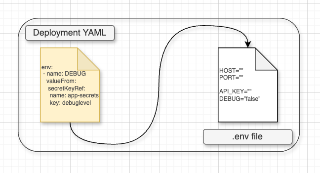

# deployment-secrets-dotenv
Simple CLI that fetches deployment/cronjob YAML secrets from Kubernetes/OpenShift and writes them down into an `.env` file.



## Requirements  🛠
 - Python 3.7 - 3.12
 - Kubernetes CLI (kubectl) or OpenShift (oc)

## Installing  ⚙️
```sh
pip install git+https://github.com/parklez/deployment-secrets-dotenv.git
```
This way the tool is globally available in your machine via terminal.

## How to use?  📖
- 💡You must be logged into a cluster & have permission to read its secrets!💡

This script was made with this structure in mind (you might have something similar)\
You may specify the location of any of these files using parameters.

```sh
my-app-example/
|-- .travis/
|   |-- deployment*.ym*l
|-- .env-example
```

- Choose one of the ways of fulfilling your `.env` file below 👇

#### A. Write all secrets from `deployment.yml` into `.env`:
```
$ secrets write-deployment-env --help                                                                         
Usage: secrets write-deployment-env [OPTIONS]

Options:
  --env-output TEXT  Path to output environment file. Default: '.env'
  --deployment TEXT  Path to Deployment "*.yml" folder, not the file! Default:
                     "./.travis"
  --deploy-env TEXT   Replaces "$DEPLOY_ENV" in "name" key from secret.
                      Default: "dev".
  --help             Show this message and exit.
```
```sh
$ secrets write-deployment-env --deployment <path to deployment.yml folder> --env-output <path to .env output>
```

#### B. Fetch (deployment secrets) and fullfil .env-example template into .env file:
```
$ secrets write-from-example --help
Usage: secrets write-from-example [OPTIONS]

Options:
  --env-example TEXT  Path to template file for environment variables.
                      Default: ".env-example".
  --env-output TEXT   Path to output environment file. Default: '.env'
  --deployment TEXT   Path to Deployment "*.yml" folder, not the file!
                      Default: "./.travis"
  --deploy-env TEXT   Replaces "$DEPLOY_ENV" in "name" key from secret.
                      Default: "dev".
  --help              Show this message and exit.
```
```sh
$ secrets write-from-example --deployment <path to deployment.yml folder> --env-example <path to .env-example template> --env-output <path to .env output>
```

#### C. Fetch "env" from running pod and save into .env file:
```
$ secrets write-pod-env --help                                                                 
Usage: secrets write-pod-env [OPTIONS]

Options:
  --pod TEXT         Pod name. Example: "my-cool-app-1234".
  --env-output TEXT  Path to output environment file. Default: '.env-<pod>'
  --help             Show this message and exit.
```
```sh
$ secrets write-pod-env --pod <my-cool-app-1234> --env-output <path to .env output>
```

#### Further reading 📝

- https://python-packaging-tutorial.readthedocs.io/en/latest/setup_py.html
- https://medium.com/nerd-for-tech/how-to-build-and-distribute-a-cli-tool-with-python-537ae41d9d78
- https://github.com/pypa/sampleproject
- https://packaging.python.org/en/latest/tutorials/packaging-projects/